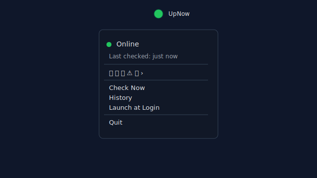

## UpNow

UpNow is a tiny, privacy‑friendly macOS menu bar app that shows whether you’re online, offline, or need to sign in to a captive portal — at a glance.

- Clear icon in the menu bar (color + shape)
- Compact history row of recent checks (oldest → now)
- Manual refresh, quick access to Network settings
- Optional Launch at Login helper

## Screenshot

## Build
- Open `UpNow.xcodeproj` in Xcode (macOS 13+).
- Select the “UpNow” scheme and Run. The icon appears in the menu bar.
- To enable Launch at Login, use the menu toggle (uses a helper target).

## Details
- App source lives in `swiftui-app/`. See `swiftui-app/README.md` for implementation notes.
- Default bundle IDs are `com.example.UpNow` and `com.example.UpNow.LoginItem`; change to your domain before distributing.

## License
MIT — see `LICENSE`.

